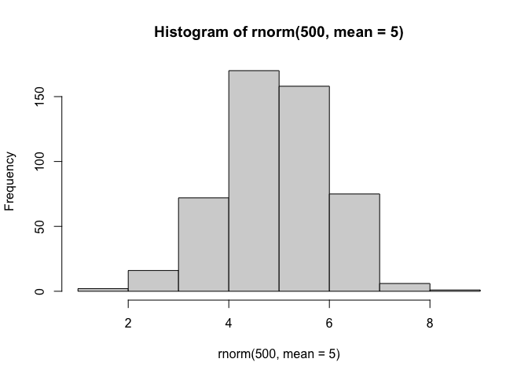
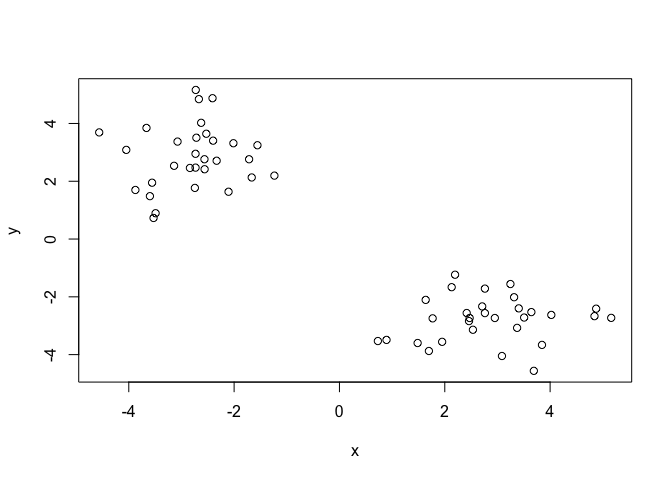
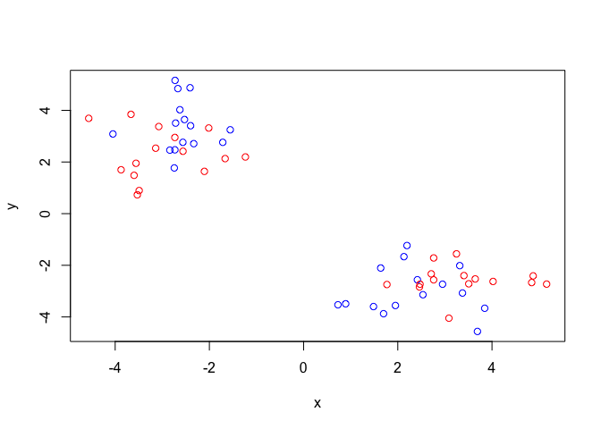
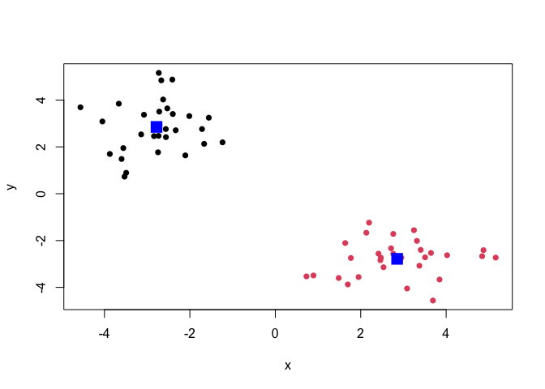
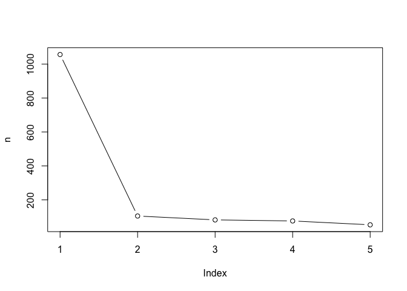
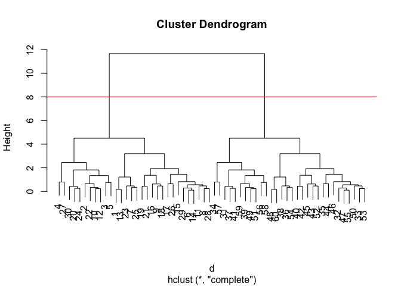
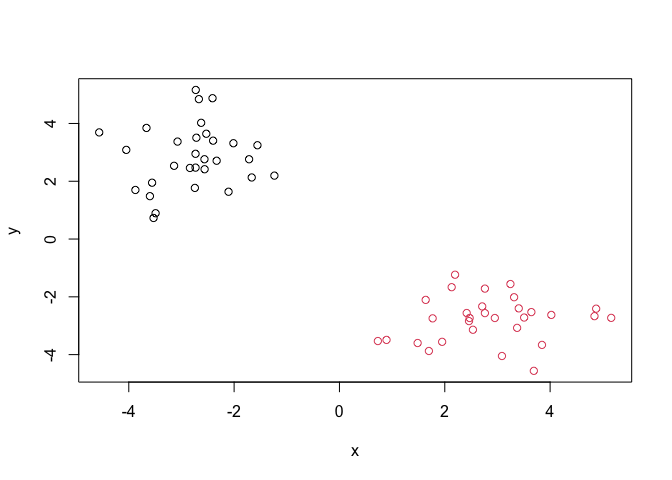

# Class07: Machine Learning 1
Fan Wu(PID:A15127541)

Today we will explore some fundamental machine learning methods
including clustering and dimensionality reduction

## K-means clustering

To see how this works, let’s first makeup some data to cluster where we
know what the answer should be. We can use the `rnorm()` function to
help here:

``` r
hist(rnorm(500, mean = 5))
```



``` r
x <- c(rnorm(30, mean = -3), rnorm(30, mean = 3))
#`rev()` means reverse
y <- rev(x)
```

``` r
x <- cbind(x,y)
plot(x)
```



The main function for K-means clustering in “base R” is `kmeans()`

``` r
k <- kmeans(x, centers = 2)
k
```

    K-means clustering with 2 clusters of sizes 30, 30

    Cluster means:
              x         y
    1 -2.780458  2.852259
    2  2.852259 -2.780458

    Clustering vector:
     [1] 1 1 1 1 1 1 1 1 1 1 1 1 1 1 1 1 1 1 1 1 1 1 1 1 1 1 1 1 1 1 2 2 2 2 2 2 2 2
    [39] 2 2 2 2 2 2 2 2 2 2 2 2 2 2 2 2 2 2 2 2 2 2

    Within cluster sum of squares by cluster:
    [1] 52.3958 52.3958
     (between_SS / total_SS =  90.1 %)

    Available components:

    [1] "cluster"      "centers"      "totss"        "withinss"     "tot.withinss"
    [6] "betweenss"    "size"         "iter"         "ifault"      

To get at the results of the returned list object we can use the dollar
`$` syntax

> Q. How many points are in each cluster?

``` r
k$size
```

    [1] 30 30

> Q. What ‘component’ of your result object details -cluster
> assigment/membership -cluster center

``` r
k$cluster
```

     [1] 1 1 1 1 1 1 1 1 1 1 1 1 1 1 1 1 1 1 1 1 1 1 1 1 1 1 1 1 1 1 2 2 2 2 2 2 2 2
    [39] 2 2 2 2 2 2 2 2 2 2 2 2 2 2 2 2 2 2 2 2 2 2

``` r
k$centers
```

              x         y
    1 -2.780458  2.852259
    2  2.852259 -2.780458

> Q. Make a cluster result figure of the data colored by cluster
> membership and show cluster centers.

``` r
plot(x, col=c("red", "blue"))
```



``` r
plot(x, col= k$cluster, pch = 16)

points(k$centers, col = "blue", pch =15, cex = 2)
```



``` r
# `cex` is character expansion, `pch` changes the shape of the plot
```

K-means clustering is very popular as it is very fast and relatively
straight forward: it takes numeric data as input and returns the cluster
membership vector etc.

The “issue” is we tell `kmeans()` how many clusters we want!

> Q. Run kmeans again and cluster into 4 groups/clusters and plot
> results like we did above

``` r
n<- NULL
for (i in 1:5){
  n <- c(n, kmeans(x,centers = i)$tot.withinss)
}
plot(n, type = "b")
```



## Hierarchical Clustering

The main “base R” function for Hierarchical Clustering is called
`hclust()`. Here we can’t just input our data, we need to first
calculate a distance matrix(e.g. `dist()`) for our data and use this as
input to `hclust()`

``` r
d <- dist(x)
hc <- hclust(d)
hc
```


    Call:
    hclust(d = d)

    Cluster method   : complete 
    Distance         : euclidean 
    Number of objects: 60 

There is a plot method for hclust results lets try it This is better
than `kmeans()` because it reveals similarity, and doesn’t force center
on things

``` r
plot(hc)
abline(h = 8, col = "red")
```



To get our cluster “membership” vector (i.e. our main clustering result)
we can “cut” the tree at a given height or at a height that yields a
given “k” groups

``` r
cutree(hc, h = 8)
```

     [1] 1 1 1 1 1 1 1 1 1 1 1 1 1 1 1 1 1 1 1 1 1 1 1 1 1 1 1 1 1 1 2 2 2 2 2 2 2 2
    [39] 2 2 2 2 2 2 2 2 2 2 2 2 2 2 2 2 2 2 2 2 2 2

``` r
grps <- cutree(hc, k = 2)
```

> Q. Plot the data with our hclust result coloring

``` r
plot (x, col = grps)
```



\#Principle Component Analysis(PCA)

## PCA of UK food data

Import food data from an online CSV file:

``` r
url <- "https://tinyurl.com/UK-foods"
x <- read.csv(url)
head(x)
```

                   X England Wales Scotland N.Ireland
    1         Cheese     105   103      103        66
    2  Carcass_meat      245   227      242       267
    3    Other_meat      685   803      750       586
    4           Fish     147   160      122        93
    5 Fats_and_oils      193   235      184       209
    6         Sugars     156   175      147       139

``` r
rownames(x) <- x[,1]
x <- x[,-1]
x
```

                        England Wales Scotland N.Ireland
    Cheese                  105   103      103        66
    Carcass_meat            245   227      242       267
    Other_meat              685   803      750       586
    Fish                    147   160      122        93
    Fats_and_oils           193   235      184       209
    Sugars                  156   175      147       139
    Fresh_potatoes          720   874      566      1033
    Fresh_Veg               253   265      171       143
    Other_Veg               488   570      418       355
    Processed_potatoes      198   203      220       187
    Processed_Veg           360   365      337       334
    Fresh_fruit            1102  1137      957       674
    Cereals                1472  1582     1462      1494
    Beverages                57    73       53        47
    Soft_drinks            1374  1256     1572      1506
    Alcoholic_drinks        375   475      458       135
    Confectionery            54    64       62        41

``` r
# read properly and add row names while reading
x <- read.csv(url, row.names = 1)
x
```

                        England Wales Scotland N.Ireland
    Cheese                  105   103      103        66
    Carcass_meat            245   227      242       267
    Other_meat              685   803      750       586
    Fish                    147   160      122        93
    Fats_and_oils           193   235      184       209
    Sugars                  156   175      147       139
    Fresh_potatoes          720   874      566      1033
    Fresh_Veg               253   265      171       143
    Other_Veg               488   570      418       355
    Processed_potatoes      198   203      220       187
    Processed_Veg           360   365      337       334
    Fresh_fruit            1102  1137      957       674
    Cereals                1472  1582     1462      1494
    Beverages                57    73       53        47
    Soft_drinks            1374  1256     1572      1506
    Alcoholic_drinks        375   475      458       135
    Confectionery            54    64       62        41

Some base figures

``` r
barplot(as.matrix(x), beside=T, col=rainbow(nrow(x)))
```


``` r
barplot(as.matrix(x), col=rainbow(nrow(x)))
```


There is one plot that can be useful for small datasets:

``` r
pairs(x, col=rainbow(10), pch=16)
```


> Main point: It can be difficult to spot major trends and patterns even
> in relatively small multivariate datasets ( here we only have 17
> dimensions, typically we have 1000s)

## PCA to the rescue

The main function in “base R” for PCA is called `prcomp()`

I will take the transpose of our data so the “foods” are in the columns

``` r
#PCA on food, so we need to take transpose of x, to get food to be column
pca <- prcomp( t(x) )
summary(pca)
```

    Importance of components:
                                PC1      PC2      PC3       PC4
    Standard deviation     324.1502 212.7478 73.87622 2.921e-14
    Proportion of Variance   0.6744   0.2905  0.03503 0.000e+00
    Cumulative Proportion    0.6744   0.9650  1.00000 1.000e+00

``` r
# look at the "proportion of variance" to see how much of the spread pca cover
```

``` r
#$x tells us where the country lies on PCA
pca$x
```

                     PC1         PC2        PC3           PC4
    England   -144.99315   -2.532999 105.768945 -9.152022e-15
    Wales     -240.52915 -224.646925 -56.475555  5.560040e-13
    Scotland   -91.86934  286.081786 -44.415495 -6.638419e-13
    N.Ireland  477.39164  -58.901862  -4.877895  1.329771e-13

``` r
cols <- c("orange", "red", "blue","darkgreen")
plot(pca$x[,1],pca$x[,2], col = cols, pch = 16)
```


``` r
# this plot is showing that along PC1, 3 countries are similar, while PC1 captures 67% of the data
# look at contributions can tell us what food caused the difference
```

``` r
library(ggplot2)
ggplot(pca$x) + 
  aes(PC1, PC2) + 
  geom_point(col = cols)
```


``` r
pca$rotation
```

                                 PC1          PC2         PC3          PC4
    Cheese              -0.056955380  0.016012850  0.02394295 -0.409382587
    Carcass_meat         0.047927628  0.013915823  0.06367111  0.729481922
    Other_meat          -0.258916658 -0.015331138 -0.55384854  0.331001134
    Fish                -0.084414983 -0.050754947  0.03906481  0.022375878
    Fats_and_oils       -0.005193623 -0.095388656 -0.12522257  0.034512161
    Sugars              -0.037620983 -0.043021699 -0.03605745  0.024943337
    Fresh_potatoes       0.401402060 -0.715017078 -0.20668248  0.021396007
    Fresh_Veg           -0.151849942 -0.144900268  0.21382237  0.001606882
    Other_Veg           -0.243593729 -0.225450923 -0.05332841  0.031153231
    Processed_potatoes  -0.026886233  0.042850761 -0.07364902 -0.017379680
    Processed_Veg       -0.036488269 -0.045451802  0.05289191  0.021250980
    Fresh_fruit         -0.632640898 -0.177740743  0.40012865  0.227657348
    Cereals             -0.047702858 -0.212599678 -0.35884921  0.100043319
    Beverages           -0.026187756 -0.030560542 -0.04135860 -0.018382072
    Soft_drinks          0.232244140  0.555124311 -0.16942648  0.222319484
    Alcoholic_drinks    -0.463968168  0.113536523 -0.49858320 -0.273126013
    Confectionery       -0.029650201  0.005949921 -0.05232164  0.001890737

``` r
# a positive number in PC1 means it shows difference in this category
```

``` r
ggplot(pca$rotation) +
  aes(PC1, rownames(pca$rotation)) +
  geom_col()
```


PCA looks super useful and we will come back to describe this further
next lab :-)
