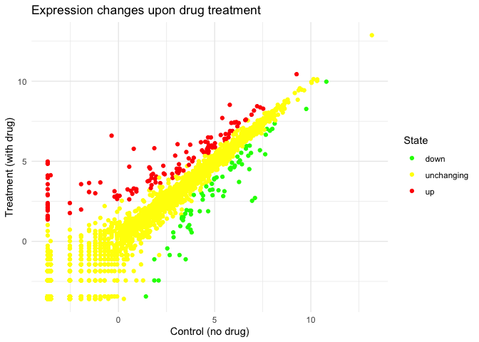
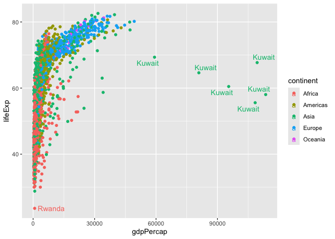

# Class 05: Data Viz with ggplot
Fan Wu(PID:A15127541)

Today, we are exploring the **ggplot** package and how to make nice
figures in R.

There are lots of ways to make figures and plot in R. These include:

- so called “base” R
- and add on packages like **ggplot2**

Here is a simple “base” R plot.

``` r
head(cars)
```

      speed dist
    1     4    2
    2     4   10
    3     7    4
    4     7   22
    5     8   16
    6     9   10

We can simply pass this to the `plot()` function.

``` r
plot(cars)
```


> Key-point: Base R is quick but not so nice looking in some folks eyes

Let’s see how we can plot this with **ggplot2**

1st, I need to install this add-on package.

For any package, we use the `install.pacakges()`function. - **WE DO THIS
IN THE CONSOLE, NOT our report**. This is is a one time only deal

2nd, We need to load the package with the `library()` function every
time we want to use it.

``` r
library(ggplot2)
ggplot(cars)
```


Every ggplot is composed of at least 3 layers:

- **data** (i.e. data.frame w/ the things you want to plot) -aesthetics:
  **aes()** that map the columns of data to your plot
  features(i.e. aesthetics) -geometry like **geom_point()** that decides
  how the plot appears

``` r
ggplot(cars) +
  aes(x=speed, y=dist) +
  geom_point()
```


``` r
hist(cars$speed)
```


> Key point: For simple graphs, **base R** is simpler and quicker But as
> things get more custom and complex, **ggplot2** wins

Let’s add more layers to our ggplot

Add a line showing the relationship between x and y Add a title Add
custom axis labels “Speed(MPH)” and “Distance(ft)” Change the theme…

``` r
ggplot(cars) +
  aes(x=speed, y=dist) +
  geom_point() +
  geom_smooth(method = "lm", se = FALSE) +
  labs(title = "Silly plot of Speed vs Stoping distance", 
       x = "Speed(MPH)", 
       y = "Distance(ft)") +
  theme_minimal()
```

    `geom_smooth()` using formula = 'y ~ x'


## Going further

Read some gene expression data

``` r
url <- "https://bioboot.github.io/bimm143_S20/class-material/up_down_expression.txt"
genes <- read.delim(url)

head(genes)
```

            Gene Condition1 Condition2      State
    1      A4GNT -3.6808610 -3.4401355 unchanging
    2       AAAS  4.5479580  4.3864126 unchanging
    3      AASDH  3.7190695  3.4787276 unchanging
    4       AATF  5.0784720  5.0151916 unchanging
    5       AATK  0.4711421  0.5598642 unchanging
    6 AB015752.4 -3.6808610 -3.5921390 unchanging

> Q1. How many genes are in this dataset? each row contain info for a
> gene

``` r
nrow(genes)
```

    [1] 5196

> Q2. How many “up” regulated genes are there? we can sum all the true
> as true=1, false=0, to get the number of “up” regulated genes

``` r
sum(genes$State == "up")
```

    [1] 127

A useful function for counting “up” occurances of things in a vector is
the `table()` function

``` r
table(genes$State)
```


          down unchanging         up 
            72       4997        127 

try graph

``` r
P <- ggplot(genes) +
  aes(x=Condition1, 
      y=Condition2,
      color = State) +
  geom_point()

P
```


``` r
P + 
  scale_color_manual(values = c("green","yellow","red")) +
  labs(title = "Expression changes upon drug treatment",
       x = "Control (no drug)", 
       y = "Treatment (with drug)") +
  theme_minimal()
```



## More Plotting

Read in the gapminder dataset

``` r
# File location online
url <- "https://raw.githubusercontent.com/jennybc/gapminder/master/inst/extdata/gapminder.tsv"

gapminder <- read.delim(url)
```

Let’s have a peak

``` r
head(gapminder, 10)
```

           country continent year lifeExp      pop gdpPercap
    1  Afghanistan      Asia 1952  28.801  8425333  779.4453
    2  Afghanistan      Asia 1957  30.332  9240934  820.8530
    3  Afghanistan      Asia 1962  31.997 10267083  853.1007
    4  Afghanistan      Asia 1967  34.020 11537966  836.1971
    5  Afghanistan      Asia 1972  36.088 13079460  739.9811
    6  Afghanistan      Asia 1977  38.438 14880372  786.1134
    7  Afghanistan      Asia 1982  39.854 12881816  978.0114
    8  Afghanistan      Asia 1987  40.822 13867957  852.3959
    9  Afghanistan      Asia 1992  41.674 16317921  649.3414
    10 Afghanistan      Asia 1997  41.763 22227415  635.3414

``` r
tail(gapminder)
```

          country continent year lifeExp      pop gdpPercap
    1699 Zimbabwe    Africa 1982  60.363  7636524  788.8550
    1700 Zimbabwe    Africa 1987  62.351  9216418  706.1573
    1701 Zimbabwe    Africa 1992  60.377 10704340  693.4208
    1702 Zimbabwe    Africa 1997  46.809 11404948  792.4500
    1703 Zimbabwe    Africa 2002  39.989 11926563  672.0386
    1704 Zimbabwe    Africa 2007  43.487 12311143  469.7093

> Q4. How many different countries are in this dataset?

``` r
nrow(gapminder)
```

    [1] 1704

length () tell us the size of the vector

``` r
length(table(gapminder$country))
```

    [1] 142

> Q5. How many different continent values are in this dataset?

``` r
length(table(gapminder$continent))
```

    [1] 5

unique() returns the unique elements of a vector or the unique rows of a
data frame, removing any duplicates

``` r
unique(gapminder$continent)
```

    [1] "Asia"     "Europe"   "Africa"   "Americas" "Oceania" 

Make version 1 figure

``` r
ggplot(gapminder) +
  aes(x=gdpPercap,
      y=lifeExp,
      col = continent) +
  geom_point()
```


``` r
ggplot(gapminder) +
  aes(x=gdpPercap,
      y=lifeExp,
      col = continent,
      label = country) +
  geom_point() +
  geom_text()
```


I can use **ggrepel** package to make more sensible labels here by
typing `install.packges()` in R console.

``` r
library(ggrepel)

ggplot(gapminder) +
  aes(x=gdpPercap,
      y=lifeExp,
      col = continent,
      label = country) +
  geom_point() +
  geom_text_repel()
```

    Warning: ggrepel: 1697 unlabeled data points (too many overlaps). Consider
    increasing max.overlaps



I want a seperate pannel per continent

``` r
ggplot(gapminder) +
  aes(x=gdpPercap,
      y=lifeExp,
      col = continent,
      label = country) +
  geom_point() +
  facet_wrap(~continent)
```


## Summary

ggplot is just adding one layer after another in plots

ggplot2 offers several advantages over base R plotting:

1.  Layered Grammar: ggplot uses a consistent, layered approach, letting
    you build plots by adding layers for data, aesthetics, and geometric
    objects. This makes complex plots easier to construct and modify
    [\[1\]](https://drive.google.com/file/d/1BYSWJLROqxA1YpuDhJkzUolhiZqiOOKg/view?usp=drivesdk),
    [\[2\]](https://drive.google.com/file/d/1tFqKg9_nhVMmKYfiM1CQKDS2PmPwLh8n/view?usp=drivesdk),
    [\[3\]](https://drive.google.com/file/d/1Clw2_EJ_hY3USNwObiPnxpIQIfirxfW0/view?usp=drivesdk),
    [\[5\]](https://drive.google.com/file/d/15xXaaIcCWOc_x1gJLdySWOd_sfMXTiaw/view?usp=drivesdk),
    [\[4\]](https://drive.google.com/file/d/1FDBbIi2Rlw2In9mClB7Mub8oUPgx6y8h/view?usp=drivesdk).

2.  Publication Quality: ggplot produces visually appealing,
    publication-ready graphics with sensible defaults, making it easier
    to create beautiful figures without extensive tweaking
    [\[1\]](https://drive.google.com/file/d/1BYSWJLROqxA1YpuDhJkzUolhiZqiOOKg/view?usp=drivesdk),
    [\[2\]](https://drive.google.com/file/d/1tFqKg9_nhVMmKYfiM1CQKDS2PmPwLh8n/view?usp=drivesdk),
    [\[3\]](https://drive.google.com/file/d/1Clw2_EJ_hY3USNwObiPnxpIQIfirxfW0/view?usp=drivesdk).

3.  Customization: While base R gives pixel-level control, ggplot makes
    it much easier to customize and combine plot elements, legends, and
    themes, especially for complex visualizations
    [\[1\]](https://drive.google.com/file/d/1BYSWJLROqxA1YpuDhJkzUolhiZqiOOKg/view?usp=drivesdk),
    [\[2\]](https://drive.google.com/file/d/1tFqKg9_nhVMmKYfiM1CQKDS2PmPwLh8n/view?usp=drivesdk),
    [\[3\]](https://drive.google.com/file/d/1Clw2_EJ_hY3USNwObiPnxpIQIfirxfW0/view?usp=drivesdk).

4.  Consistency: ggplot uses a unified syntax for different plot types,
    reducing the need to learn many separate functions as in base R
    [\[1\]](https://drive.google.com/file/d/1BYSWJLROqxA1YpuDhJkzUolhiZqiOOKg/view?usp=drivesdk),
    [\[2\]](https://drive.google.com/file/d/1tFqKg9_nhVMmKYfiM1CQKDS2PmPwLh8n/view?usp=drivesdk),
    [\[3\]](https://drive.google.com/file/d/1Clw2_EJ_hY3USNwObiPnxpIQIfirxfW0/view?usp=drivesdk),
    [\[5\]](https://drive.google.com/file/d/15xXaaIcCWOc_x1gJLdySWOd_sfMXTiaw/view?usp=drivesdk).

5.  Reproducibility: ggplot code is modular and scriptable, making it
    easy to reproduce and automate plots for different datasets
    [\[1\]](https://drive.google.com/file/d/1BYSWJLROqxA1YpuDhJkzUolhiZqiOOKg/view?usp=drivesdk),
    [\[2\]](https://drive.google.com/file/d/1tFqKg9_nhVMmKYfiM1CQKDS2PmPwLh8n/view?usp=drivesdk).

What do you think is the biggest advantage for your own work?
